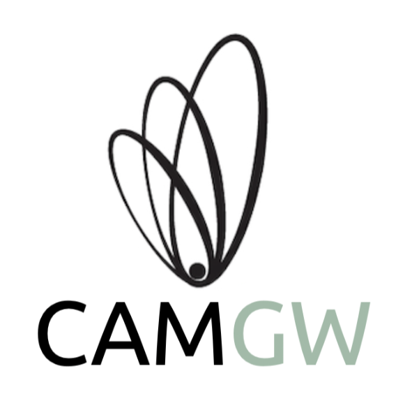

# Welcome to CamGW

CamGW is a collaborative initiative bringing together researchers from various departments at the University of Cambridge working on gravitational wave science.

## Participating Departments and Institutes

- **[Department of Applied Mathematics and Theoretical Physics (DAMTP)](https://www.damtp.cam.ac.uk/)**
- **[Institute of Astronomy (IoA)](https://www.ast.cam.ac.uk/)**
- **[Cavendish Laboratory (Department of Physics)](https://www.phy.cam.ac.uk/)**
- **[Kavli Institute for Cosmology Cambridge (KICC)](https://www.kicc.cam.ac.uk/)**

## Quick Links

- [Meetings](meetings.html)
- [Information for Students](students.html)
- [People](people.html)
- [Research Themes](research.html)
- [News & Announcements](news.html)
- [Publications](publications.html)
