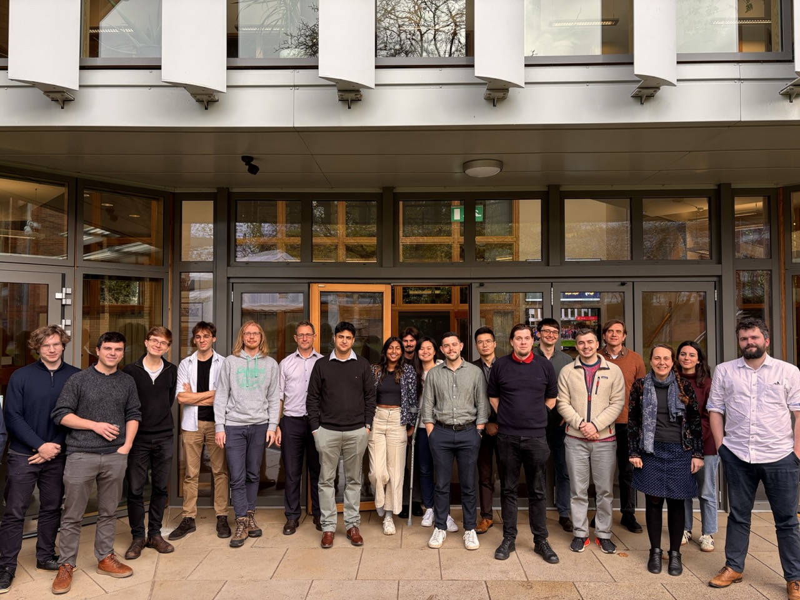

# Meetings

## Upcoming Meetings

### Lent Term 2025

Details TBC. Watch this space!

## Past Meetings

### 27 November 2025

Our second meeting was held as a Kavli Science Focus Meeting at KICC, titled [*"CamGW: Launching the Next Phase of GW Science in Cambridge"*](https://www.kicc.cam.ac.uk/events/kavli-science-themed-meetings/camgw-launching-next-phase-gw-science-cambridge).
As well as a broad range of talks by Cambridge-based researchers, we were delighted to have a keynote talk by Prof Stephen Fairhurst (Cardiff University; spokesperson of the LIGO Scientific Collaboration) on the past, present, and future of GW astronomy with LIGO/Virgo/KAGRA.

- A recording of the event is [available on YouTube](https://youtu.be/CVPLXJTDF_o)

### 11 March 2025

We held our inaugural event as a Kavli Science Focus Meeting at KICC, titled [*"CamGW: Surveying the range of gravitational-wave science in Cambridge"*](https://www.kicc.cam.ac.uk/events/kavli-science-themed-meetings/camgw).
The day featured a series of excellent talks and panel discussions, and we were pleased to have over forty participants from across CamGW's affiliated departments.

- A recording of the event is [available on YouTube](https://youtu.be/eolnD-fOduk)
- Slides from the 1-minute flash talks can be [accessed here](assets/meetings/2025-03-11/flash-talks.pdf)

[Back to Home](index.html)
