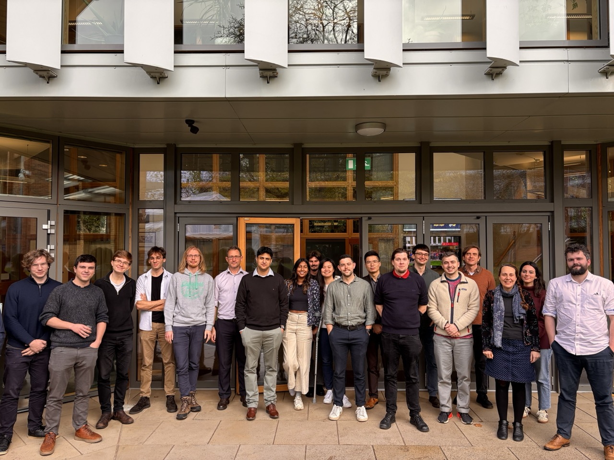

# Meetings

## Upcoming Meetings

### 25 November 2026

Our 2026/27 Michaelmas term meeting will take place 14.30-17.00 on Wednesday 25 November in the Ryle Meeting Room at KICC. We'll be joined by [Prof Laura Nuttall](https://www.port.ac.uk/about-us/structure-and-governance/our-people/our-staff/laura-nuttall) (University of Portsmouth), who will give a talk on EM follow-up of LVK events. Stay tuned for further details!

## Past Meetings

### 4 June 2026

For our 2025/26 Easter term meeting we were joined by [Prof Tessa Baker](https://tessabaker.space/) (University of Portsmouth), who gave a talk on *"Cosmology with GW Sirens"*, followed by talks from CamGW members Seppe Staelens, Adrian Chung, and Nikhil Sarin.

- A recording is [available on YouTube](https://youtu.be/h_8KuGUb3oM)

### 5 March 2026

For our 2025/26 Lent term meeting we were joined by [Dr Katy Clough](https://kaclough.github.io/) (Queen Mary University of London), who gave a talk on *"Probing beyond GR and the Standard Model in the strong gravity regime"*.
We also had excellent talks from CamGW members Toshiya Namikawa and Stephanie Buttigieg, as well as a discussion session led by Priscilla Canizares.

- A recording of the first half of the event is [available on YouTube](https://youtu.be/hc-g80jTQzI) (second half missing due to human error - apologies!)

### 27 November 2025

Our second meeting was held as a Kavli Science Focus Meeting at KICC, titled [*"CamGW: Launching the Next Phase of GW Science in Cambridge"*](https://www.kicc.cam.ac.uk/events/kavli-science-themed-meetings/camgw-launching-next-phase-gw-science-cambridge).
As well as a broad range of talks by Cambridge-based researchers, we were delighted to have a keynote talk by [Prof Stephen Fairhurst](https://profiles.cardiff.ac.uk/staff/fairhursts) (Cardiff University; spokesperson of the LIGO Scientific Collaboration) on the past, present, and future of GW astronomy with LIGO/Virgo/KAGRA.

- A recording of the event is [available on YouTube](https://youtu.be/CVPLXJTDF_o)

### 11 March 2025

We held our inaugural event as a Kavli Science Focus Meeting at KICC, titled [*"CamGW: Surveying the range of gravitational-wave science in Cambridge"*](https://www.kicc.cam.ac.uk/events/kavli-science-themed-meetings/camgw).
The day featured a series of excellent talks and panel discussions, and we were pleased to have over forty participants from across CamGW's affiliated departments.

- A recording of the event is [available on YouTube](https://youtu.be/eolnD-fOduk)
- Slides from the 1-minute flash talks can be [accessed here](assets/meetings/2025-03-11/flash-talks.pdf)

[Back to Home](index.html)
