# People

## CamGW Organisers

### [James Alvey](https://www.cai.cam.ac.uk/people/dr-james-alvey)
- **Department:** KICC and IoA
- **Research Interests:** Simulation-based inference, LISA, machine learning, bayesian inference
- **Email:** [jbga2@cam.ac.uk](mailto:jbga2@cam.ac.uk)

### [Alex Jenkins](https://alex-c-jenkins.github.io/)
- **Department:** KICC and DAMTP
- **Research Interests:** Cosmology, gravitational waves, early-Universe physics
- **Email:** [acj46@cam.ac.uk](mailto:acj46@cam.ac.uk)

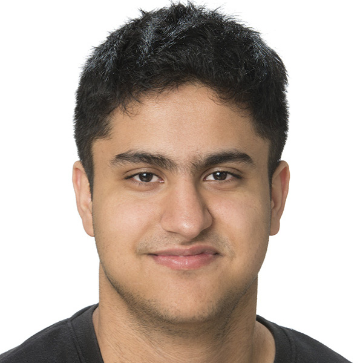
### [Nikhil Sarin](https://nikhil-sarin.github.io/)
- **Department:** KICC and IoA
- **Research Interests:** Gravitational waves, neutron stars, and EM transients
- **Email:** [ns2043@cam.ac.uk](mailto:ns2043@cam.ac.uk)

## Faculty

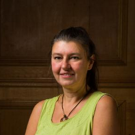
### [Irena Borzym](https://www.caths.cam.ac.uk/directory/ms-irena-borzym)
- **Department:** DAMTP
- **Research Interests:** Classical GW, black hole mergers, twistor methods
- **Email:** [immb100@cam.ac.uk](mailto:immb100@cam.ac.uk)

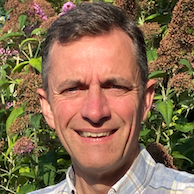
### [Anthony Challinor](https://www.kicc.cam.ac.uk/directory/adc1000)
- **Department:** IoA, DAMTP and KICC
- **Research Interests:** CMB and large-scale structure cosmology; primordial gravitational waves
- **Email:** [a.d.challinor@ast.cam.ac.uk](mailto:a.d.challinor@ast.cam.ac.uk)

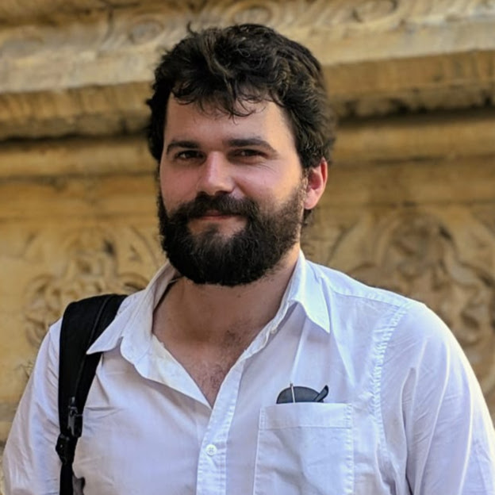
### [Will Handley](https://www.handley-lab.co.uk)
- **Department:** IoA and KICC
- **Research Interests:** Bayesian machine learning and nested sampling; early universe cosmology; dark matter constraints (GAMBIT); cosmic dawn detection (REACH); gravitational wave data analysis
- **Email:** [wh260@cam.ac.uk](mailto:wh260@cam.ac.uk)

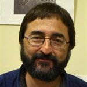
### [Fernando Quevedo](https://www.damtp.cam.ac.uk/person/fq201)
- **Department:** DAMTP
- **Research Interests:** String Theory and its potential phenomenological and cosmological implications; high-frequency gravitational waves
- **Email:** [fq201@cam.ac.uk](mailto:fq201@cam.ac.uk)

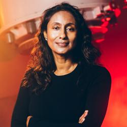
### [Hiranya Peiris](https://www.ast.cam.ac.uk/people/hiranya.peiris)
- **Department:** IoA and KICC
- **Research Interests:** Cosmology, galaxy evolution, astroparticle physics, early universe theory, Bayesian analysis and machine learning, gravitational wave astrophysics
- **Email:** [hiranya.peiris@ast.cam.ac.uk](mailto:hiranya.peiris@ast.cam.ac.uk)

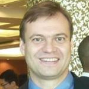
### [Roman Rafikov](https://www.damtp.cam.ac.uk/person/rrr34)
- **Department:** DAMTP
- **Research Interests:** Orbital evolution of GW sources, planet formation, N-body dynamics, fluid dynamics, accretion disks, and high-energy astrophysics
- **Email:** [rrr@damtp.cam.ac.uk](mailto:rrr@damtp.cam.ac.uk)

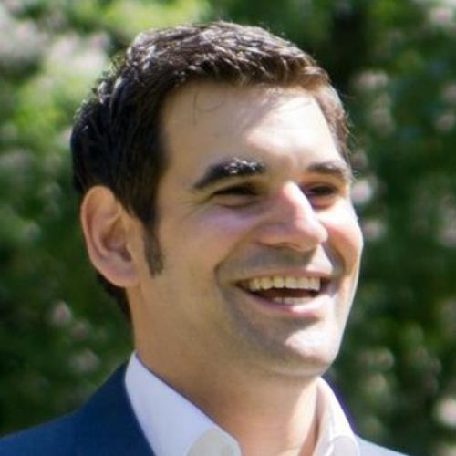
### [Ulrich Schneider](https://www.manybody.phy.cam.ac.uk/)
- **Department:** Cavendish
- **Research Interests:** Many-body physics, and atom interferometry with ultracold atoms. Member of the AION, MAGIS, and TVLBAI collaborations that aim to measure gravitational waves with long-baseline atom interferometers.
- **Email:** [uws20@cam.ac.uk](mailto:uws20@cam.ac.uk)

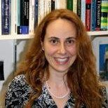
### [Debora Sijacki](https://www.kicc.cam.ac.uk/directory/ds484)
- **Department:** IoA and KICC
- **Research Interests:** Cosmic structure formation, hydrodynamical simulations, supermassive black holes, LISA
- **Email:** [deboras@ast.cam.ac.uk](mailto:deboras@ast.cam.ac.uk)

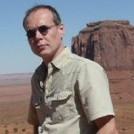
### [Ulrich Sperhake](https://www.damtp.cam.ac.uk/person/us248)
- **Department:** DAMTP and KICC
- **Research Interests:** Numerical relativity, black holes, compact objects
- **Email:** [us248@cam.ac.uk](mailto:us248@cam.ac.uk)

## Research Fellows and Postdocs

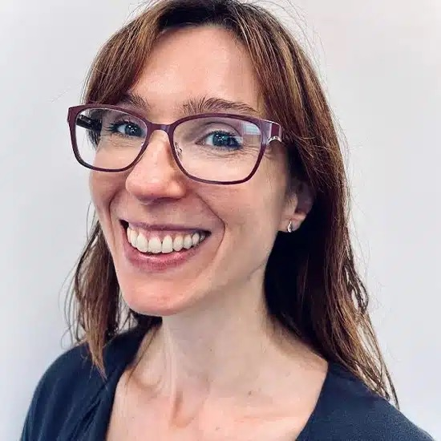
### [Priscilla Canizares Martinez](https://daphnejackson.org/fellow/dr-priscilla-canizares-martinez/)
- **Department:** DAMTP
- **Research Interests:** Theoretical physics, machine learning, particularly in gravitational-wave astronomy
- **Email:** [pc464@cam.ac.uk](mailto:pc464@cam.ac.uk)

### [Adrian Ka-Wai Chung](https://www.damtp.cam.ac.uk/person/kwc43)
- **Department:** DAMTP
- **Research Interests:** Gravitational waves, black hole ringdown, tests of general relativity, cosmology
- **Email:** [kwc43@cam.ac.uk](mailto:kwc43@cam.ac.uk)

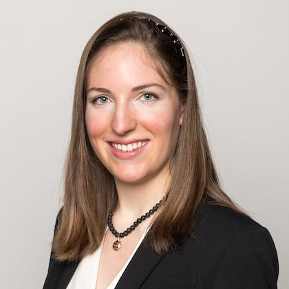
### [Emilie Hertig](https://www.kicc.cam.ac.uk/staff/emilie-hertig)
- **Department:** IoA and KICC
- **Research Interests:** Early-universe cosmology, inflationary physics, CMB delensing, false vacuum decay, gravitational waves, Bayesian inference, machine learning
- **Email:** [emh83@ast.cam.ac.uk](mailto:emh83@ast.cam.ac.uk)

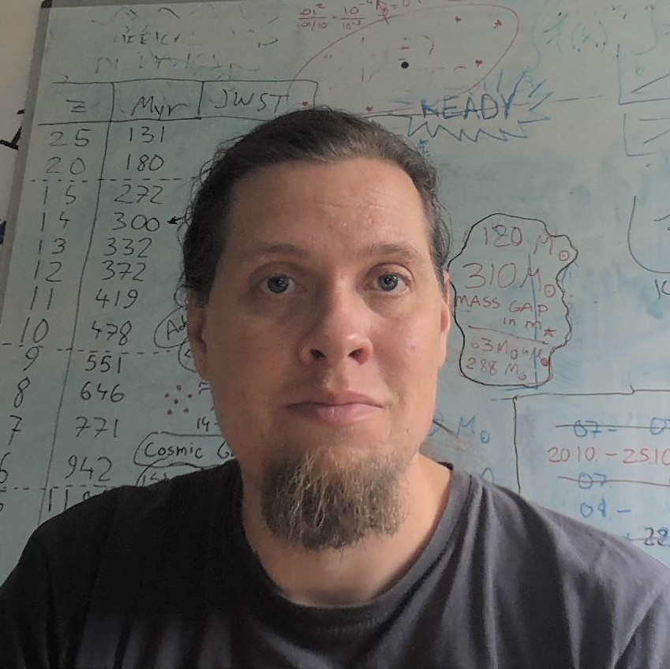
### [Antti Rantala](https://www.kicc.cam.ac.uk/staff/dr-antti-rantala)
- **Department:** IoA and KICC
- **Research Interests:** Supermassive and intermediate-mass black holes; nuclear stellar clusters and globular clusters; gravitational waves; stellar and galactic dynamics; N-body simulations; high-performance computing
- **Email:** [ajr249@cam.ac.uk](mailto:ajr249@cam.ac.uk)

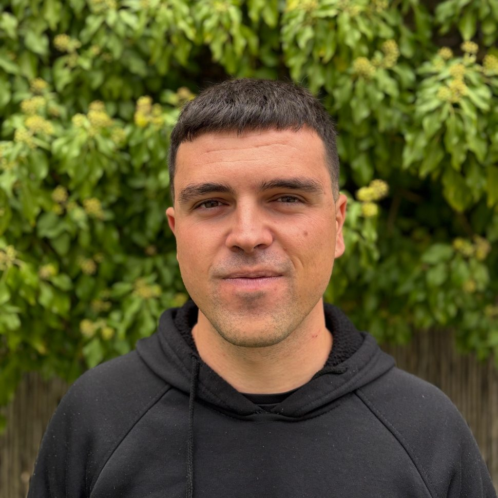
### [Gonzalo Villa](https://www.cai.cam.ac.uk/people/dr-gonzalo-villa)
- **Department:** DAMTP
- **Research Interests:** String theory, cosmology, and gravitational waves
- **Email:** [gv297@cam.ac.uk](mailto:gv297@cam.ac.uk)

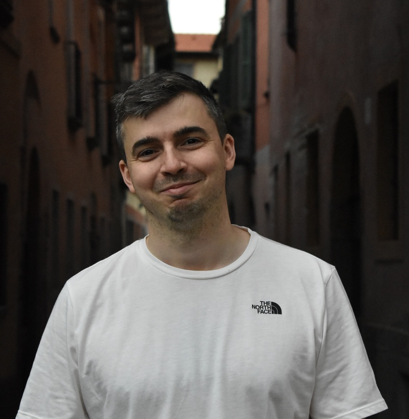
### [David Yallup](https://yallup.github.io)
- **Department:** IoA and KICC
- **Research Interests:** Bayesian inference; GPU sampling algorithms; gravitational wave data analysis
- **Email:** [dy297@cam.ac.uk](mailto:dy297@cam.ac.uk)

## Graduate Students

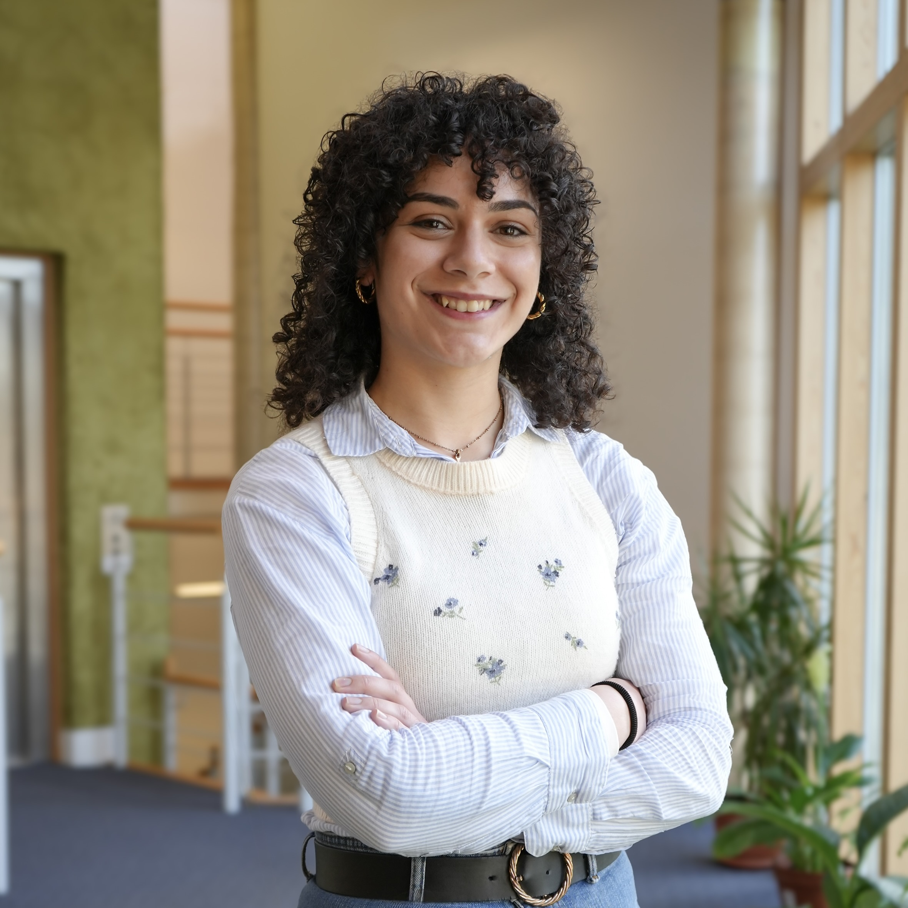
### Stephanie Buttigieg
- **Department:** IoA and KICC
- **Research Interests:** Supermassive black hole mergers, cosmological simulations, pulsar timing arrays
- **Email:** [sb2583@cam.ac.uk](mailto:sb2583@cam.ac.uk)

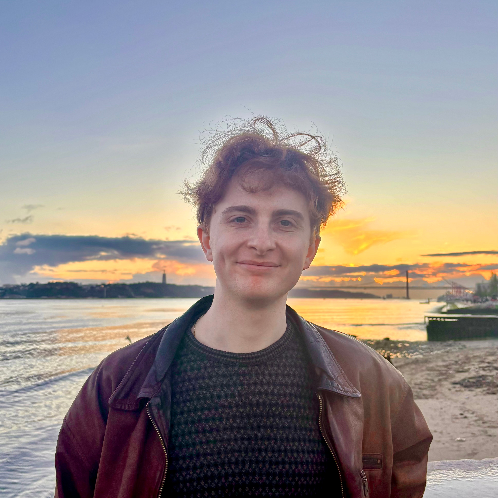
### Richard Dyer
- **Department:** IoA
- **Research Interests:** Black hole ringdown in numerical relativity, Bayesian inference
- **Email:** [richard.dyer@ast.cam.ac.uk](mailto:richard.dyer@ast.cam.ac.uk)

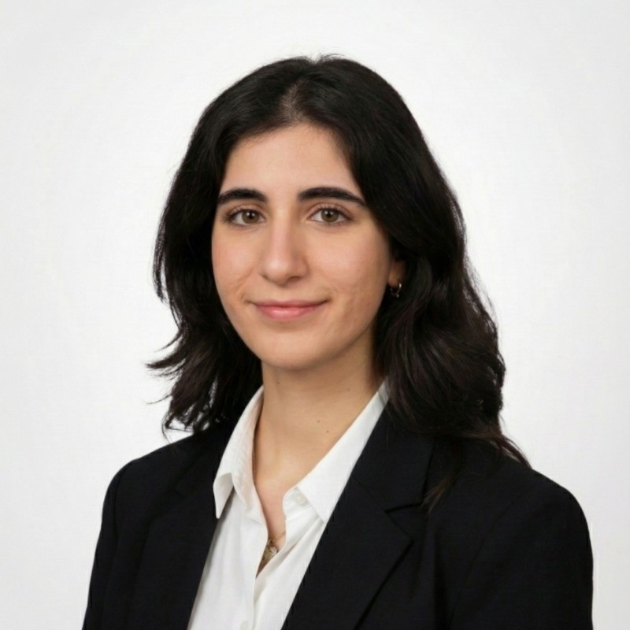
### [Ericka Florio](https://www.damtp.cam.ac.uk/person/eaf49)
- **Department:** DAMTP
- **Research Interests:** Numerical relativity, early-Universe cosmology
- **Email:** [eaf49@cam.ac.uk](mailto:eaf49@cam.ac.uk)

### [Gareth Marks](https://www.damtp.cam.ac.uk/person/gam54)
- **Department:** DAMTP
- **Research Interests:** Numerical relativity, black holes, compact objects
- **Email:** [gam54@cam.ac.uk](mailto:gam54@cam.ac.uk)

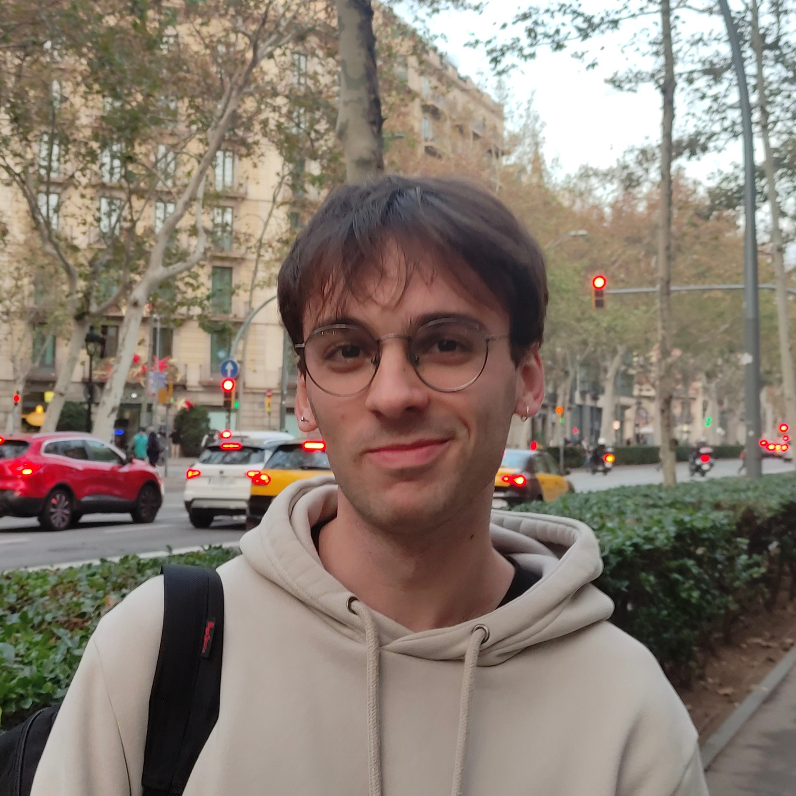
### Joan Núñez Corbacho
- **Department:** DAMTP
- **Research Interests:** Numerical relativity, critical phenomena, black holes, boson stars
- **Email:** [jn498@cam.ac.uk](mailto:jn498@cam.ac.uk)

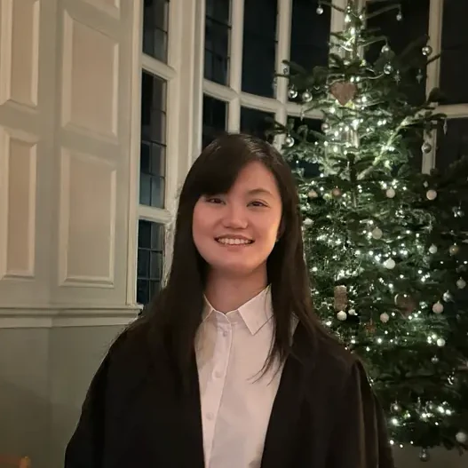
### [Dily Duan Yi Ong](https://dilyong.github.io/)
- **Department:** Cavendish and KICC
- **Research Interests:** Cosmology, astrophysics, Bayesian statistics, machine learning, model comparison, tension quantification, nested sampling
- **Email:** [dlo26@cam.ac.uk](mailto:dlo26@cam.ac.uk)

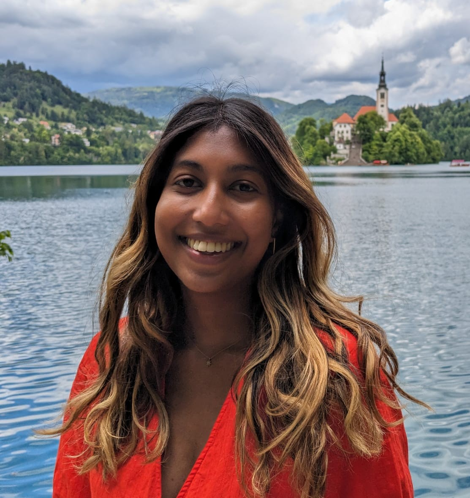
### Metha Prathaban
- **Department:** Cavendish and KICC
- **Research Interests:** Bayesian inference; GW parameter estimation; next-generation data; GPUs; machine learning
- **Email:** [myp23@cam.ac.uk](mailto:myp23@cam.ac.uk)

### [Mario Ramos Hamud](https://www.damtp.cam.ac.uk/person/mr895)
- **Department:** DAMTP
- **Research Interests:** String theory and cosmology
- **Email:** [mr895@cam.ac.uk](mailto:mr895@cam.ac.uk)

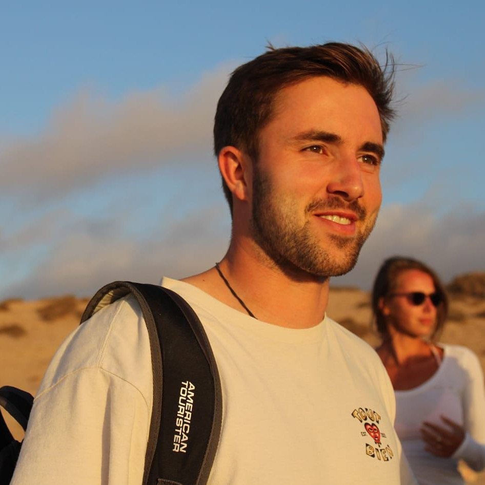
### [Seppe Staelens](https://seppestaelens.github.io/)
- **Department:** DAMTP
- **Research Interests:** Gravitational waves, numerical relativity, boson stars, black holes, machine learning
- **Email:** [ss3033@cam.ac.uk](mailto:ss3033@cam.ac.uk)

## Alumni

Former members of CamGW who have moved on to other positions.

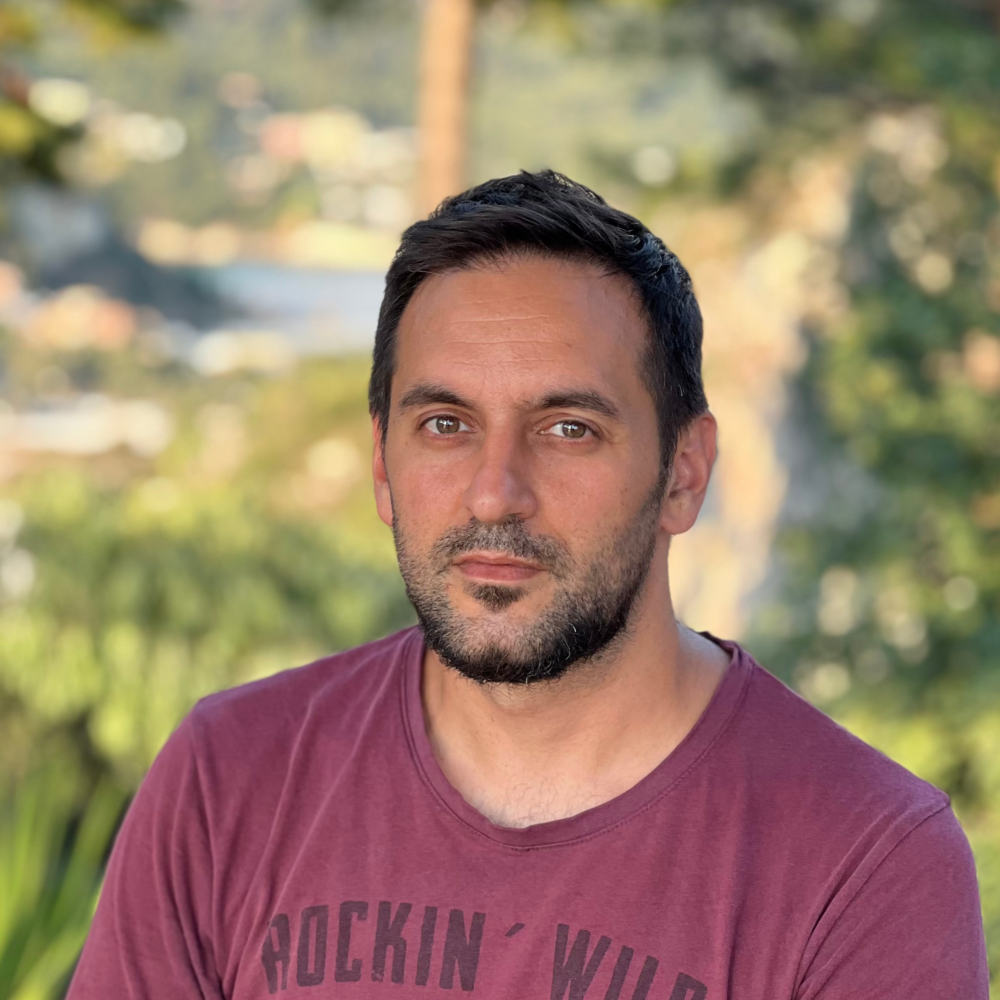
### [Michalis Agathos](https://www.qmul.ac.uk/maths/profiles/agathosm.html)
- **Department:** formerly KICC and DAMTP (now faculty at QMUL)
- **Research Interests:** Gravitational-wave theory, source modelling, and data analysis; tests of general relativity; neutron star equation of state
- **Email:** [m.agathos@qmul.ac.uk](mailto:m.agathos@qmul.ac.uk)

[Back to Home](index.html)
